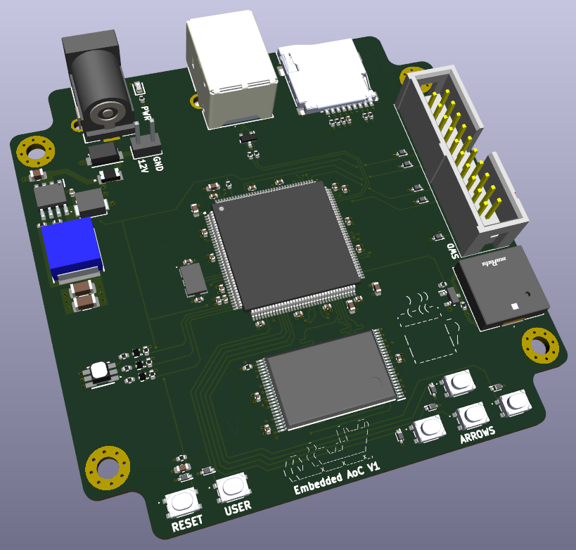

# Embedded_AoC
## Introduction
The days are flying and the time is nearly due, to help Santa with his IT problems are you helping him too?

From the 1st to the 25th of december it his time to step up, but a man of this age requires a little bit of backup. He needs our assistance in his time of need to bring happiness and joy, so he can gift everyone a little toy. All systems online and ready to party, and you will always see that everything at the moment of truth, turns naughty.

To ensure christmass is a success I will provide backup on the fly, but his sleigh is limited in power and not equiped with wi-fi. Hardware needs to be compact and not weight down his sleigh, hence why it does not even have a display.

May my engineering prowes create machinery capable of this mission in this years Advent of Code edition.

### Real introduction
As embedded software developer my work generaly constraints me on available processing power and memory requiring carefull programming. As part of my self study I like doing software puzzles and designing hardware so 1 is 1 and so we have a custom PCB for AoC.

My main goals for this project is designing faster hardware and getting the external memory to work at proper speeds. The second part of these goals is to solve all the puzzles using the limited power and memory.

## Hardware

    Processor:      
        Model:  STM32H533ZET6
        Clock:  0.25 GHz
        Flash:  512kB
        Memory: 272kB(RAM) + 8MB(SRAM)

    Peripherals:
        USB-FS
        RGB status LED
        Piezo buzzer
        Reset button
        User button
        Arrow buttons